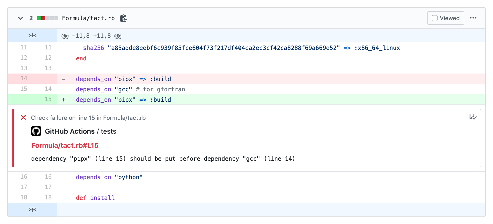

# Homebrew Formula Audit Action (archived)

This GitHub Action has been superseded by features now included in Homebrew itself in [#8564](https://github.com/Homebrew/brew/pull/8564), [#8684](https://github.com/Homebrew/brew/pull/8684). It remains here for historical reference.

----

An action that audits your [Homebrew formula](https://brew.sh) using the built-in `brew audit` command. Audit problems identified will be annotated with inline annotations for easy correction.



## Usage

```yaml
name: Audit Homebrew Formula
on:
  push:
    branches: master
  pull_request: []
jobs:
  tests:
    runs-on: ubuntu-latest
    steps:
    - uses: actions/checkout@v2
    - uses: jonchang/audit-action@master
```
